Version 5.5

# Introduction

Peakaboo is a robust XRF spectral analysis software platform that is
freely available and is specifically designed to be user friendly. It is
a cross-platform desktop application written in Java. The original
software was developed in 2011 as part of the CANARIE-sponsored Science
Studio project. This User Manual takes users through all startup
procedures and provides an exposition of all features of the platform.
These include: Addition of Formats, Peak Fitting, Mapping, Mathematical
Filters and Extending Peakaboo.

Peakaboo allows users to interpret complex XRF spectral data using a
routine that identifies the characteristic K, L, and M element patterns,
along with summation and escape peaks present in the spectrum. The
spatial intensity distributions can then be plotted as 2D element maps.
Users can extend the software’s functionality by creating custom filters
and adding support for new file formats using the Java Development Kit.

Peakaboo is designed to be able to read data in many formats from any
XRF system, including both synchrotron sources as well as laboratory XRF
instruments. “Plugins” are created to open the different file formats.
Currently, Peakaboo recognizes datasets consisting of individual single
point scans, text files of rows of space-separated numbers where each
row represents a single spectrum, as well as more complex hdf5 formats,
which are becoming increasingly common. New file formats can be added by
downloading or programing additional Plugins.

## Accepted File Formats

Out of the box, Peakaboo provides support for XRF data in a plain-text
format. Peakaboo Plain-Text is a simple XRF format comprised of rows of
space-separated numbers. Each row represents a single spectrum.

Because of the wide variety of data formats, Peakaboo also makes it easy
to create plug-ins for supporting additional data formats. Some examples
of file formats supported by plug-ins include Amptek, Sigray, and Inca
Emsa. See the section on “Plugins” for more information.

Peakaboo also allows users who are familiar with the Java programming
language to add support for new file formats. See the section on
“Extending Peakaboo” for more information.

## Getting Help

If you have any questions or concerns not addressed in this guide,
please feel free to contact the developer at `nsherry4` @ `uwo.ca`

# Getting Started

## Opening Data

Select ![open] `Open` or ![menu] `Menu` → `Open` to locate
your XRF data. If all scan point data is contained in a single file,
simply select that file and open it. If there are many individual scan
point files, (e.g. one scan per file), then locate them in their
directory and use `Control + Click` to select more than one of them, or
`Control + A` to select all of them. If no XRF data appears, it is
likely that the appropriate plug-in is not loaded (see Plug-in Section).

Because Peakaboo has a tabbed interface, additional data sets may be
opened and processed without having to close other data sets.

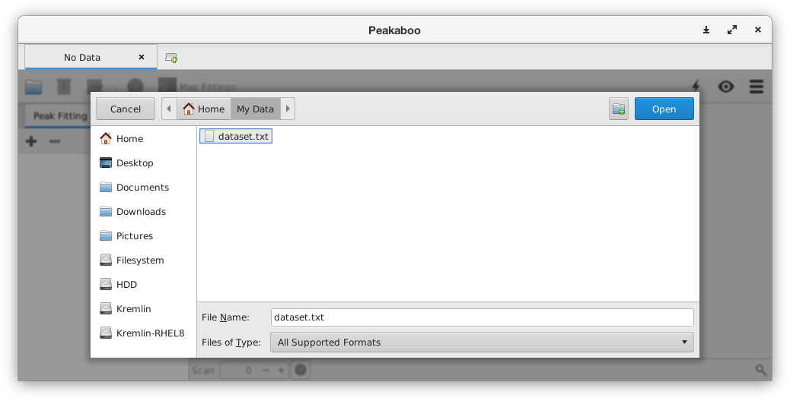
<p align="center">
Peakaboo’s file selection dialog
</p>

## File Format Conflicts

While rare, it is possible that more than one of the plug-ins that
Peakaboo uses to read XRF data will believe that it can open a
particular data set. This is usually the result of many different file
formats having some of the same properties, such as similar file
extensions (e.g. `.txt`, `.dat`, `.xml`, …). In the event that Peakaboo
cannot automatically determine which XRF reader plug-in to use, it will
ask you to indicate which format your data is in. Select the entry which
best matches your data.

## Viewing the Data

The ![find] `Zoom` icon on the bottom right of the window allows you to expand 
the x-axis (energy scale). You can use the scroll bar below the scan 
(or click and drag on the spectrum itself) to pan back and forth to 
view different energy regions.

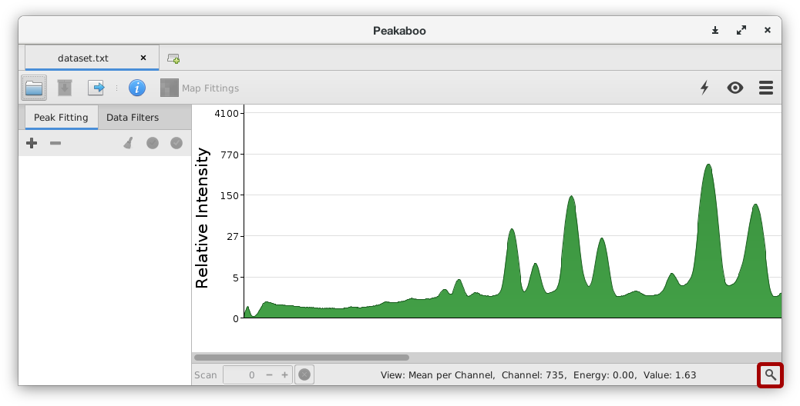
<p align="center">
Zoom controls and horizontal scrollbar
</p>

## Individual Scans

The `Scan` field on the left side of the status bar, under the spectrum
view, allows you to view individual spectra in a map.

Click on the `+` and `-` controls to select the desired scan, or enter a
value and press `Enter`. This field will be disabled if you are using 
another view mode, like the mean average or strongest per channel composites 
rather than individual scans.

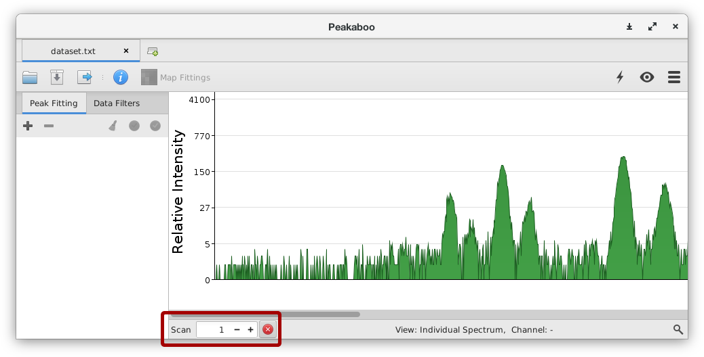
<p align="center">
Scan number selector
</p>

## Energy Calibration

The ![menu-energy] `Energy Calibration` menu in the upper right allows you to configure
the energy range of the dataset. If your dataset contains these values
(and if Peakaboo can read them), the minimum and maximum energy values
will be set automatically. If not, you will have to enter them manually.

These values can be tweaked or adjusted by selecting several major
elements known or suspected to be present in the sample and adjusting
the energy range until the associated peaks fit properly (See the
section on Peak Fitting for more information on adding fittings).

In the calibration menu, the number in the Maximum Energy field is the
maximum energy that is collected on the XRF detector. Unless the minimum
energy on the detector is non-zero, no other additions to the
calibration menu are necessary.

Peakaboo can also try to auto-detect the energy calibration with the
![auto] `Guess Energy Calibration` tool. You should always review any results
from this tool to make sure that they are correct.

A minimum of two elements must be present in the Element Table (see
Fitting). An additional check on the veracity of the calibration
involves the `Ar K` line at 2.95 keV. Argon gas is a component of the
air surrounding the sample and its XRF signature is found in every
spectrum.

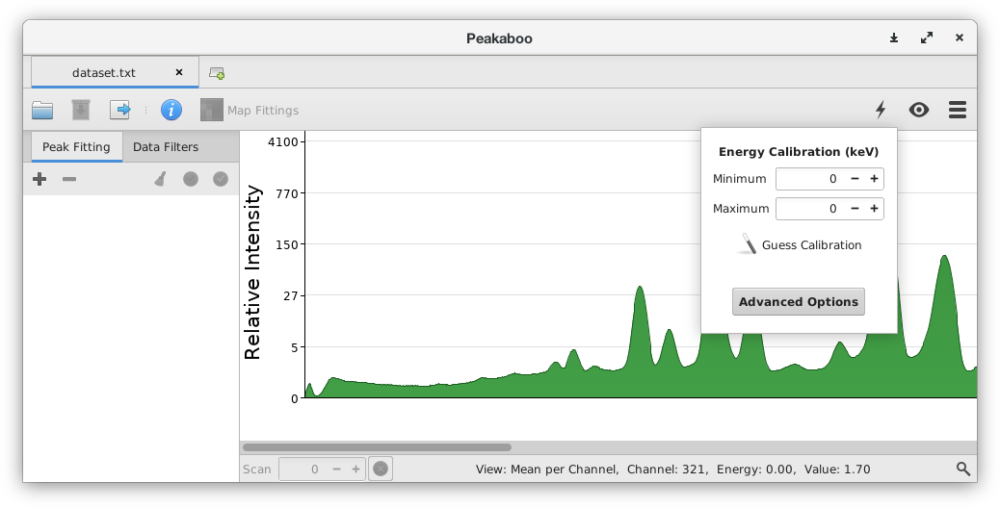
<p align="center">
The calibration menu
</p>

## Customizing the View

The ![menu-view] `View` menu contains settings to help you visualize the
spectrum. Some of the more important options are:

  - **Logarithmic Scale** Selecting Logarithmic or Linear Scale allows you to select which
    components of your data to emphasize.

  - **Curve Fit Markings** This will display all transition lines for a fitted element, scaled
    by their relative intensity. It can be useful for understanding the
    structure of a fitting’s lineshape.

  - **Max or Mean per Channel** These options allow you to view a composite spectrum when viewing
    multi-point data (i.e. line or area raster scans). These modes can
    be useful for viewing a cleaner spectrum or for finding elements
    which only appear in a small area of your dataset.

## Quick Maps

In addition to Peakaboo’s normal mapping functionality (see the sections
on Peak Fitting and Mapping), it can also generate Quick Maps, which are
maps of a single detector channel across all spectra in a dataset. These
maps are generated without any filtering or peak fitting. This can be
used to help identify peaks when energy calibration is unknown, and
allows early cropping of datasets without first having to perform peak
fitting and mapping.

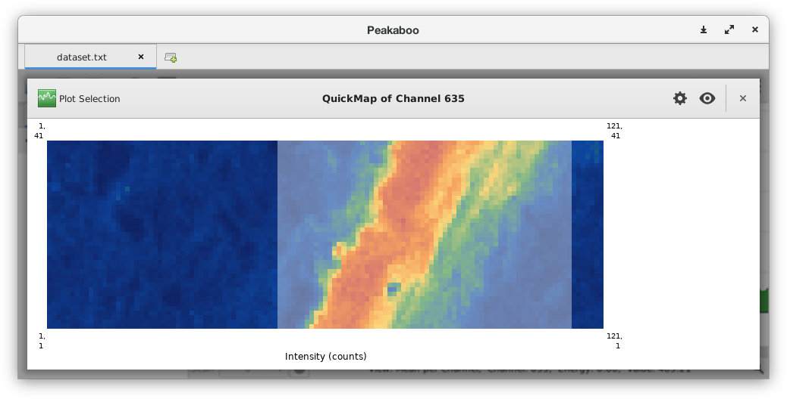
<p align="center">
Using a Quick Map to select and plot a subsection
</p>

When viewing a Quick Map of a data set without dimensional information,
the dimensions can be set or auto-detected from the ![map-size] `Sizing`
menu.

## Saving and Loading Work Sessions

If fitting of the spectrum has been has been done, it may be useful to
save your work, so that it can be continued at a later time.
Alternatively, the same fittings and parameters can be applied to a
different spectrum. In either case, this can be done through the use of
sessions.

From the toolbar, you can ![save] `Save` your session to a file.
Reloading a session can be done using the ![open] `Open` button – the
same as if you were loading a data set. As the scan data can be quite
large, the saved session does not store the data itself. When reopening
a session, the data must still be available in the same location it was
previously for it to be automatically reloaded.

## Saving and Exporting Spectral Data

Spectra that are collected in Peakaboo can be saved and/or exported in
several different ways. These are all accessed through the ![export] `Export` 
menu in the toolbar.

  - **Images** This will save the current plot – as you see it – as an image in one
    of several formats. The most common of these is the `PNG` file
    format that stores images as a raster image (coloured dots of fixed
    size on a grid). It provides an image that is acceptable for
    everyday use, but is no longer acceptable in most journals. The
    `SVG` (Scalable Vector Graphics) format is a file type that uses
    lines and points to define an image, and therefore can be scaled to
    arbitrary size with image quality suitable for publishing. `SVG`
    images are not always compatible with older versions of other
    software.

  - **Filtered Spectrum** This will save the current plot – including any filtering – as a
    `CSV` (Comma Separated Value) file. `CSV` files are a human-readable
    matrix of values separated by commas and line-breaks. They are
    readable by a broad set of other applications including
    spreadsheeting programs.

  - **Filtered Data Set** Similar to the previous option. This will save *the entire
    data set*, including any filtering, as a `CSV` (Comma
    Separated Value) file.

  - **Fittings** This option exports a listing of the fitted elements along with the
    relative heights and areas of the fitting curves for the current
    spectrum.

  - **All-in-one Zip Archive** This will export an image of the plot, the session file, and
    information on the fittings to a single zip archive.

Your spectrum, as it appears in the window, can also be saved by
selecting ![export] `Export Data` → `Plot as Image`
from the toolbar or `Control + P`. Image format options include `PNG`,
`SVG` or `PDF`. You can also save the fitting results as a text file by
selecting ![export] `Export Data` → `Fittings as Text`.

# Filters

Filters are ways to process or transform spectral data. Filters can be
accessed by clicking on the `Filters` sidebar tab and then clicking on
 ![add] `Add Filters` to display the available filters. Filters are
grouped into folders based on type. Each folder can be expanded by
clicking on the expander to the left of the filter type. Select the
filter you wish to use and then click ![ok] `OK` to add it.

After you have added the filter, you can modify or check the parameters
associated with your filter by clicking on the ![settings] `Settings` button next
to the filter. This will bring up a settings dialog for this filter. As
you change the parameters, you will see the changes reflected in the
spectrum being displayed.

To view a full listing of built-in filters and their descriptions, see
the appendix.

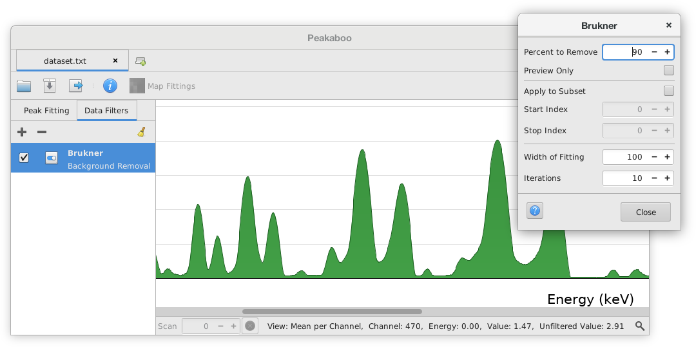
<p align="center">
The Brukner background filter’s settings window with raw data outline in plot
</p>

The use of filters will obviously alter the spectrum. If you wish to see
the original spectrum in addition to the filtered data, select ![menu-view] `View` → `Raw Data Outline`.

For a more detailed example of using a filter, as well as further
descriptions of the filters available, see the appendix.

## Noise Removal

Noise reduction is frequently essential since the spectra are often
taken at very brief intervals particularly in fly-scanning. The software
provides a number of mathematical filters that are used in noise
reduction or in background attenuation or removal. Noise filters include
moving average, fast Fourier transform (FFT) low pass, Savitsky-Golay,
and others.

Where applicable, noise removal filter parameters can be adjusted to
suit the data in question. Best noise reduction with minimum change in
peak shape is often achieved using a Savitsky-Golay filter.

## Background Removal

When using background filters, it is usually best to leave 10%-15% of
the background in place (default is 10%) in order to prevent the
background filter from removing all signal under the edges of the peak.
When too much signal around the edges of a peak is removed, it can
prevent peaks from being fitted to the proper intensity, or being fitted
at all. The degree of application of each filter on the spectrum can be
changed in the filter’s settings.

Four mathematical filters: Brukner, Polynomial, Linear Trim and Square
Snip have been provided. To most users, the effects of each filter will
appear similar: the spectral background is reduced, thus making the
peaks more pronounced. Background filters are most useful at the
beginning of a study where the user may be unfamiliar with the identity
of minor spectral peaks, or for enhancing graphical displays on posters.

However, the so-called background in XR Spectroscopy also contains
contributions from characteristic peaks that are hidden beneath their
envelopes. As such, background reduction may distort the shape and
intensity of peaks and should generally be avoided if a detailed peak
fitting is to be carried out. Background removal should also generally
be avoided before mapping. There are often less destructive ways of
obtaining good mapping results, such as using map filters or different
fitting algorithms (see those sections for more details).

# Peak Fitting

## Escape Peaks

Before doing any peak fitting, you should consider the type of detector
you used to collect the XRF spectra. Features may be present in your
spectra that are due to incoming X-rays interacting with the detector
material. For example, for a Silicon Diode Detector (SDD), there is a
probability that some of the incoming X-rays will interact with the
Silicon and emit `Si` K-shell electrons, thereby reducing the incoming
X-ray’s measured energy by 1.74 keV. This escape peak will be present
for major elements in a sample.

To adjust the type of escape peaks used in fitting the peaks in your
spectra, select ` image Calibration` → `Advanced Options` and
choose either `Silicon` or `Germanium`, depending on the type of
detector you used. If you do not need to fit escape peaks, choose
`None`. By default, `Silicon` is selected.

## Shape and Width of Fitting Curves

The shape of the curve (lineshape) used to simulate the characteristic
XRF peak is a Pseudo-Voigt function. A proper Voigt function is a
convolution of guassian and lorenzian peak shapes. The Pseudo-Voigt
function is a linear combination of the two, and provides a excellent
balance of accuracy and speed. The Voigt and Pseudo-Voigt functions are
particularly effective in dealing with tailing due to scattering and
detector effects.

In the energy calibration menu, under Advanced Options, you can choose
the type of function used for peak fittings. The pseudo Voigt function
is the default option. The Convolving Voigt function is also provided,
but is much slower. The original Lorentzian and Gaussian functions are
also provided.

In fitting each peak in the spectrum, the appropriate lineshape must
consist of an overlay of several functions since there are multiple
transitions, closely spaced in energy, that are associated with each K,
L and M-shell XRF transition. You can choose to display these individual
transitions or not with `View` → `Curve Fit` → `Markings`. Each individual 
transition is indicated by a solid line within the lineshape envelope that 
is a composite of these transitions and their probability (see Figure 5).

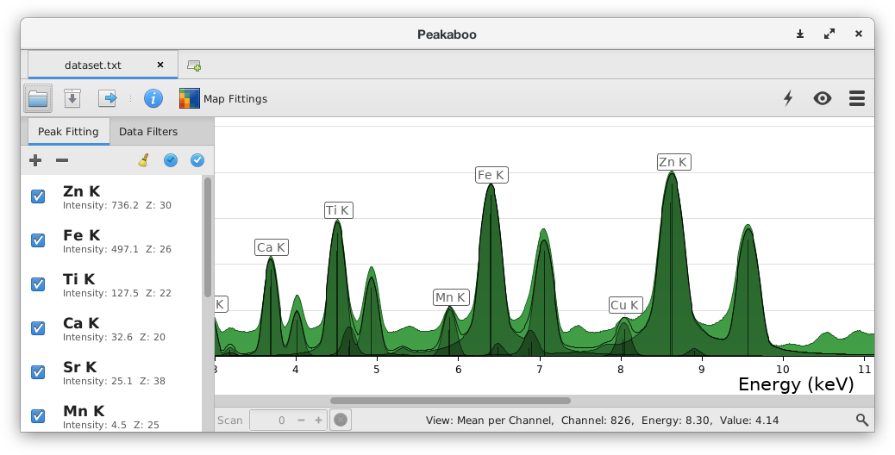
<p align="center">
Spectral Fitting of multi element sample showing individual lines
</p>

The width of XRF peaks detected by solid state devices such as a Silicon
Diode Detector (SDD) is a convolution of an invariant intrinsic width
and width that is due to electronic noise in the detector. The noise
level has improved with improved technologies and therefore it can be
changed using the Advanced Options menu. A reduction in the noise will
result in a corresponding change in the width of the fitting lineshape.
The width of the XRF characteristic peak also decreases linearly with
peak energy. This is accounted for in the simulated fitting algorithm.

The positions and relative intensities for each K, L or M XRF elemental
transition were taken from tabulated sources to build an accurate and
up-to-date data base. Fittings from the database take account of details
such as separations and relative intensities of transitions. Most
fittings are derived from data from the
[Xraylib](https://github.com/tschoonj/xraylib)  project. For high `Z`
elements where the K series fittings are not available in Xraylib,
values provided by Krause [^1] have been used. The intensity ratios have
been optimized for 20keV irradiation.

## Selecting Fittings

There are four different tools which can be used to fit your data. To
access these options, click the ![add] `Add Fittings` button at the top
of the `Peak Fitting` tab.

### Element Lookup

This option provides a listing of chemical elements that will help you
fit a K,L or M lineshape for a particular element to a peak (or peaks)
in the spectrum. A particular element can be found by scrolling through
the menu or typing the element name or atomic symbol. Then, select the
desired transition. A set of purple-coloured provisional lineshapes will
appear within the actual spectrum and an atomic symbol will appear on
the most intense component. Your assignment may or may not coincide with
the positions of spectral peaks that you are trying to identify. If the
assignment appears incorrect, click on the ![cancel] `Cancel` button, or
deselect the element and try again. If the choice appears to be correct,
click ![ok] `OK`.

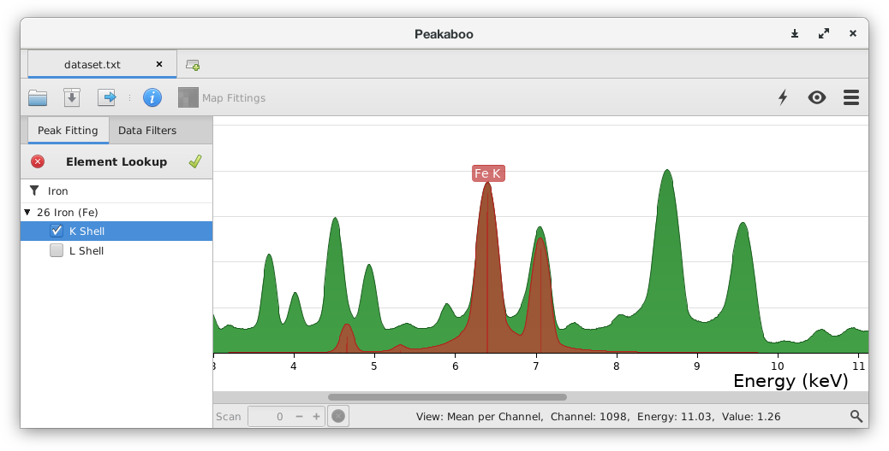
<p align="center">
The elemental lookup fitting controls
</p>

Best results are usually obtained by adding elements with the lowest
atomic numbers first and working your way up. It is recommended that you
fit the K lines first. L lines should be fit after the K lines since
spectral overlaps may be confusing. In addition to the labels for
elemental K, L, M elemental lines and summation lines on the spectrum
display, it is possible to make brief annotations adjacent to each label
by double clicking on the appropriate element in the list.

### Guided Fitting

Guided fitting will attempt to identify peaks the user selects. Click on
the peak you wish to fit and the program will fit the peak with its
recommendation. Other recommendations will also be displayed in a drop
down list in the side bar. To add another fitting, click on the ![add] `Add` 
button below the current entry and click on another peak. To edit a
previous fitting, click ![edit] `Edit`. After you are happy with the
fittings, click ![ok] `OK` to add the fittings to your list.

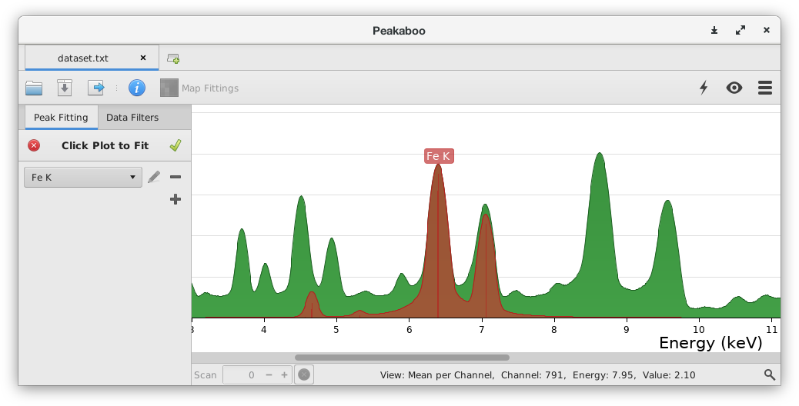
<p align="center">
The guided fitting controls
</p>

### Automatic Fitting

Automatic fitting will attempt to identify all intense peaks at once,
without user supervision. Simply selecting this option from the menu
will automatically populate the fittings list. Automatic fitting can
provide a rapid assessment of the major components of a spectrum, but
its results should still be checked for correctness.

### Summation Peaks

Additional spectral peaks can result from virtually simultaneous arrival
of signals from intense XRF peaks. These peaks are the sum of the
energies of the more intense peaks. The lineshapes already selected in
the Element Table can be summed in different combinations to create new
lineshapes on the experimental spectrum.

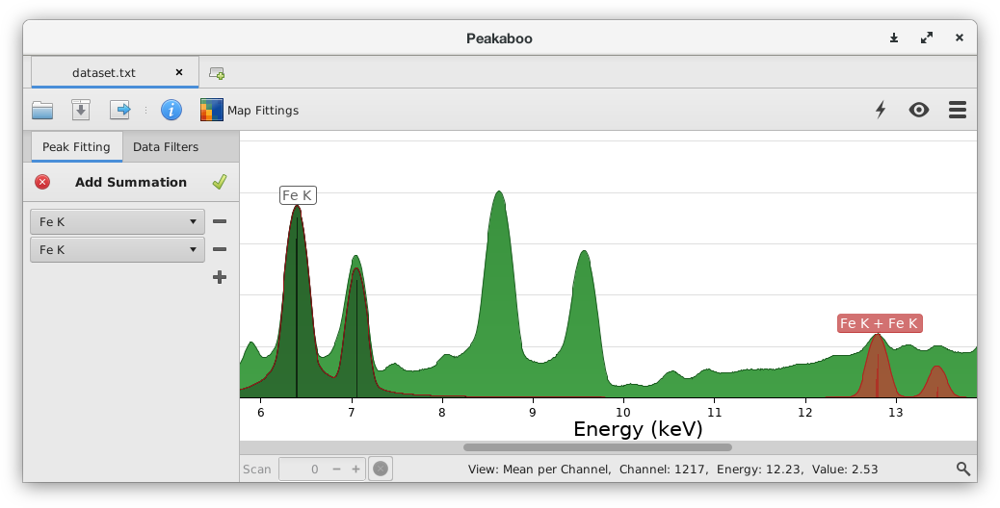
<p align="center">
The summation fitting controls
</p>

## Working with Fittings

Each fitting has a checkbox controlling whether this fitting is enabled
or not. Toggling the checkbox will allow you to temporarily remove a
specific fitting from the fitting process. Rechecking the box will
restore the fitting as it was.

Selecting a fitting in the list will cause the fitting to be highlighted
in blue. This feature is also useful to identify all components of a
lineshape in a complex overlay of spectral peaks.

## Fitting Algorithms

When trying to determine how to fit an element’s theoretical lineshape
to real data, Peakaboo has several algorithms to make this
determination. The algorithms can be selected from ![menu-energy] `Energy Calibration` → `Advanced Options` → `Single-Curve Fitting`. The
available options are:

  - **Max-Under-Curve** This is the default algorithm in Peakaboo. It is extremely fast, and
    is quite conservative in fitting against real data. Within the
    dimensions of the peak, it will never over-fit against real data.
    The drawback is that it does not handle noisy data particularly
    well.

  - **Least Squares** This is a standard optimizing algorithm minimizing the sum of the
    squares of the difference between the fitting’s lineshape and the
    data. This algorithm is excellent for working with extremely noisy
    data, but has a tendency to over-fit against data which is not as
    strong as it thinks it ought to be.

  - **Optimizing** This is a Least Squares algorithm modified to strongly penalize
    over-fitting against signal which doesn’t exist. It acts as a
    trade-off between the other two; reasonably good fitting of noisy
    data and reasonably averse to over-fitting non-existent signal.
    

<p align="center">
Comparison of mapping data treated with Max-Under-Curve (left) and Optimizing (right)
</p>

## Multi-Element Fitting Solvers

When fittings from two or more elements overlap, they content for being
fit against the same data. Peakaboo must solve this signal contention by
determining how much of the signal originates from each elemental
fitting. The algorithm can be selected from ![menu-energy] `Calibration` → `Advanced Options` → `Multi-Curve Solver`. Peakaboo
has two algorithms for determining the intensity of each contending
fitting:

A critical part of the fitting process involves the decisions to be made
when spectral peaks overlap to some degree. Decisions must be made about
mathematical approximations that will provide reliable and consistent
assignments of areas associated with the neighbouring peaks. Peakaboo
has two approaches to assessment of such data:

  - **Greedy** The Greedy fitting solver is the default fitting solver algorithm in
    Peakaboo. is extremely fast, and allows the user to control the
    order of fittings by rearranging the fittings in the side bar.
    
    This sequential approach fits peakshapes in the order in which they
    are listed in the Peak Fitting list, scaling each fitting curve, one
    at a time, using the selected fitting algorithm . Each curve is
    fitted against a spectrum with all previously fitted curves
    subtracted from it. While there are constraints due to relative
    height of peaks, there are some possibilities for inconsistencies
    since overfitting is possible.
    
    Changing the order of fittings can reveal and correct these
    problems. Select the fitting that you wish to reorder, and
    click-and-drag the element in the list to reorder it.

  - **Optimizing** The Optimizing fitting solver is a Least Squares algorithm modified
    to strongly penalize over-fitting against signal which doesn’t
    exist. This algorithm is slower than Greedy, but results in more
    nuanced fitting solutions in complex, crowded spectra with many
    overlapping peaks. An example of this approach is seen in Figure 5,
    where it is possible to fit minor L peaks in the presence of more
    intense K peaks.

  - **MultiSampling** The MultiSampling fitting solver is a variation of the Optimizing
    solver which averages several deterministically permuted orderings
    of the element fittings to eliminate any ordering effects from the
    Optimizing solver. This helps to produce more reliable results, but
    is also considerably slower for large numbers of fittings.

## Annotations

Each fitting you add can be annotated to track important context or
caveats for your work. Annotations will be displayed with the fitting’s
`Element Name` in the plot, and in tool tips in the `Peak Fitting`
sidebar.

To add an annotation, double-click on the fitting in the `Peak Fitting`
sidebar. A prompt will appear which will let you add an annotation to
the selected fitting. It can be cleared by double-clicking the entry
again and setting the

## Suggestions for Successful Fitting

  - After energy calibration, use Automatic Fitting to find and assign
    many of the more obvious peaks. Thereafter, use a combination of
    Guided Fitting and Element Lookup to identify as many peaks as
    possible.

  - Watch carefully for summation peaks. If you find one, there are
    likely others. Summation peaks are prevalent when the SDD detector
    is experiencing a higher flux of incoming photons. Use of the
    Summation Fitting process is an efficient way to cover all possible
    contributions.

  - Consider *not* using any background subtraction. Its use may distort
    some peak shapes and thereby compromise an exacting fitting
    procedure.

  - The fitted spectrum summation line should match (as closely as
    possible) the experimental line, moreso for areas of intense signal.

  - Consider trying minor adjustments to the peak width setting (FWHM
    noise level) to improve the fitting match. Increased photon flux
    will change the noise level.

# Mapping

To map the fitted elements, click on ![map] `Map Fittings` in the
toolbar. Only those fittings which are enabled in your `Peak Fitting`
list will be mapped. It is recommended that you enable all fittings for
mapping as each fitting results in an individual map which can be
disabled later. For extremely large maps, you may see some performance
gain from disabling some fittings, especially if you are using data
filtering or Optimizing/Least-Squares Curve Fitting or Fitting Solver
algorithms.

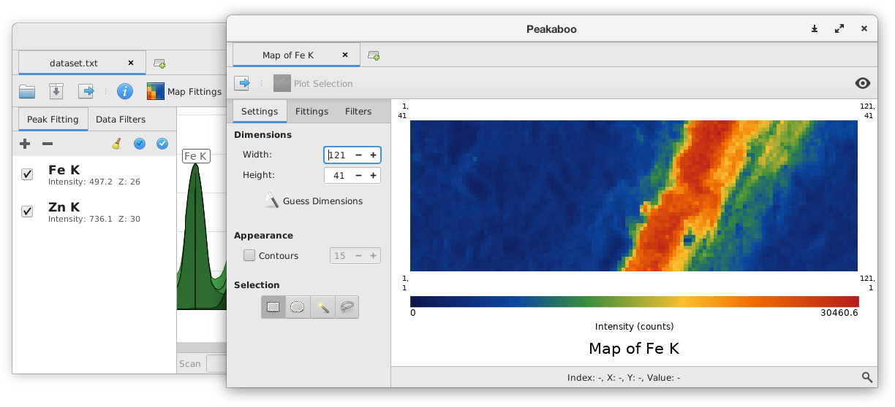
<p align="center">
Peakaboo’s mapping window
</p>

After the mapping is complete, a window will appear with a coloured map,
a scale, and a list of the mapped element lines. For datasets which
contain dimension information, map widths and heights are automatically
set to appropriate values. Otherwise, Peakaboo can attempt to find
dimensions that produce contiguous images. If this does not work (it
usually does), you will have to adjust the dimensions yourself.

All fittings will be represented in the initial map. To get the
individual element maps, uncheck all other fittings in the `Peak
Fittings` tab in the sidebar, leaving the element fitting you wish to
view. Maps can have filters applied to them the same way that spectra
can, which can help reduce outlier values and noise. For more
information, see the section on Map Filtering.

## Map Modes

### Composite

Composite is the default map mode. It sums the intensities from
different fittings into a single map. The data is displayed with a heat
map colour scale, but can also be shown in monochrome by selecting
 ![menu-view] `View` → `Monochrome`

Composite maps are scaled against a global maximum of all fittings. If
you wish to scale a fitting to its own highest intensity, select
`Visible` under the `Sort By` section in the sidebar. A minor element
will show very a low intensity distribution using `All`, but appear much
more intense with `Visible` when displayed alone.

### Overlays

The `Overlay` option for mapping is chosen from the drop down list under
`Peak Fittings` sidebar tab. This allows you to sort fittings into
different colour groups. These groups are overlaid, with the presence of
each colour indicating the intensities of their fitting groups.

**Caution:** Because Red, Green, and Blue are the primary colours for 
computer displays, care must be taken not to introduce ambiguity when 
choosing colours for overlays.

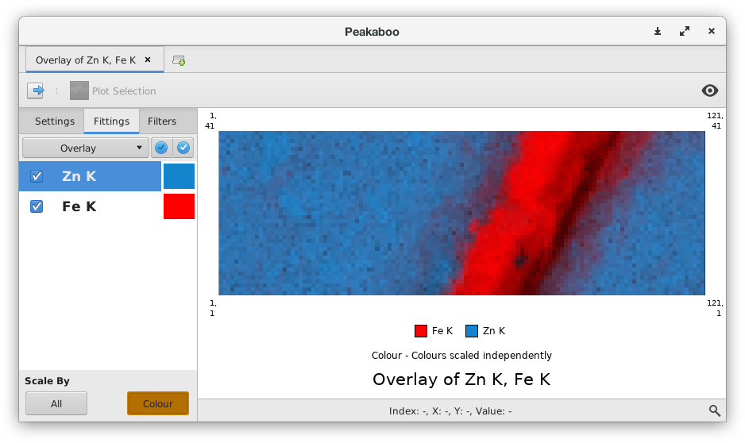
<p align="center">
Overlay of Iron and Zinc concentration
</p>

The `Scale By` options control the way that the fitting group’s colours
are scaled. With the `All` option, the highest intensity from
**all** groups of fittings is used to scale the intensities
for **every** group. With the `Colour` option, the highest
intensity from **within each** group of fittings is used to
scale the intensities for that group.

**Caution:** The`Colour` option produces maps which may be qualitatively interesting,
but are quantitatively incorrect.

Sometimes the weaker intensities for different elements can overlap to
the extent that each elemental distribution is difficult to distinguish.
In such cases, the intensity distributions can be truncated to remove
the weaker intensities and therefore clarify the overlay map. This can
be done with the `Low Signal Removal` map filter. For more information,
see the section on Map Filters.

### Ratios

Mapping of element ratios is also available within Peakaboo. Select
`Ratio` from the `Peak Fittings` dropdown list. Select the fittings you
wish to view in ratio and select the desired colours from the dropdown
lists next to each fitting.

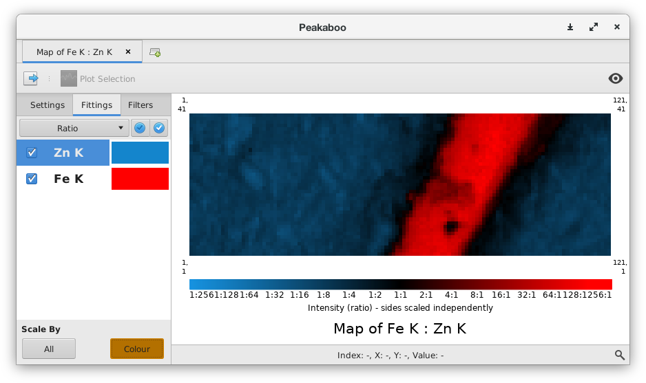
<p align="center">
Ratio of Iron and Zinc
</p>

The `Scale By` options control the way that the fitting group’s colours
are scaled. With the `All` option, the highest intensity from
**either** set of fittings is used to scale the intensities
for **both** groups. With the `Colour` option, the highest
intensity from **within each** group of fittings is used to
scale the intensities for that group.

**Caution:** The `Colour` option produces maps which may be qualitatively 
interesting, but are quantitatively incorrect.

### Correlations

Correlations can be seen by selecting `Correlation` from the `Peak
Fittings` dropdown list. Select the fittings you wish to view and choose
the desired axis from the controls next to each fitting.

The correlation map mode is a comparison of two intensity histograms,
showing the frequency with which points in a map fall into certain
intensity ranges. The number of ranges (or bins) can be controlled with
the `Granularity` control at the bottom of the sidebar.

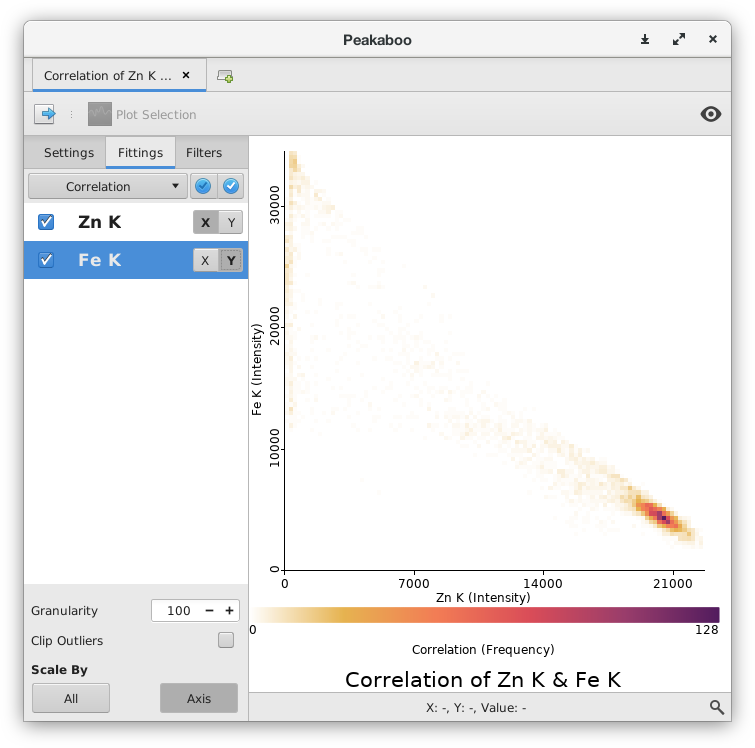
<p align="center">
Correlation of Iron and Zinc
</p>

## Map Filters

Just as with spectra, maps can be filtered to clean up the data and
improve appearance. You can add filters to your maps by selecting the
`Filters` tab in the sidebar and then clicking on ![add] `Add Filters`
to display the available filters. Filters are grouped into folders based
on type. Each folder can be expanded by clicking on the expander to the
left of the filter type. Select the filter you wish to use and then
click ![ok] `OK` to add it.


After you have added the filter, you can modify or check the parameters
associated with your filter by clicking on the ![settings] `Settings` button next
to the filter. This will bring up a settings dialog for this filter. As
you change the parameters, you will see the changes reflected in the map
being displayed. To learn more about a map filter, you can view it’s
description by hovering over the ![help] `Help` icon in the settings dialog.


<p align="center">
Comparison of mapping of a nickel intensity distribution before and
after being treated with the low signal removal filter (40% setting) and
with the weighted average filter (radius:1, repetitions
:1)
</p>


<p align="center">
Comparison of mapping data before (left) and after (right) being
treated with the Denoise filter where areas of high noise are replaced
with a smoothed value without altering the rest of the
map
</p>

**Caution** It is
important to note that these filters change the map data, and are
applied to each fitting individually, before they are combined to
produce the maps as shown. This usually doesn’t make much difference,
but can occasionally cause some confusion. To give an example, consider
the `Signal Cap` filter, which limits any given point to a cap value.
Suppose that the cap specified was 100 counts, and was applied to a
composite map of `Fe` K and `Zn` K. Because the filter is applied to
the `Fe` and `Zn` maps separately before being combined, the maximum
value of a point on the final map would be 200, rather than 100.

## Exporting Data

Maps may be saved by clicking the ![export] `Export` button on the toolbar,
and selecting ![image-symbolic] `Export as Image`. Various formats are available
for saving your element line maps, Pixel Image (`PNG`), Vector Image
(`SVG`) and `PDF` format.

Map data can also be exported as a CSV (comma separated value) file, or
in a zip archive. The zip archive will contain a CSV file and a
composite map for each fitting, as well as a saved session file.

## Errant Data

Missing or skewed spectra within a data set can be removed from the map.
Hover the mouse over the bad data point in the mapping window, and the
index of that data point will appear in the status bar at the bottom of
the window. To view the errant data point, return to the plotting
window, making sure you are in `Individual Scan` mode, and enter the
`Index #` of the invalid data in the `Scan` field at the bottom of the
window.

Click on the ![cancel] `Exclude` button to flag the scan as bad, and to
exclude it from the data set. In all future maps, this data point will
be interpolated from neighbouring data.

## Selecting Subsections

There are four ways to select sections of a map; rectangular,
elliptical, point selection by similarity, and free-hand. Selection
controls can be found on the `Map Settings` tab. Selections with
rectangular, elliptical and free-hand are accomplished by using
selections the map to create a selection mask. Selections with point
selection is accomplished by clicking on a point of interest, which will
select all points in a contiguous region with similar intensity. Double
clicking will select all points in a map with similar intensity
regardless of location.

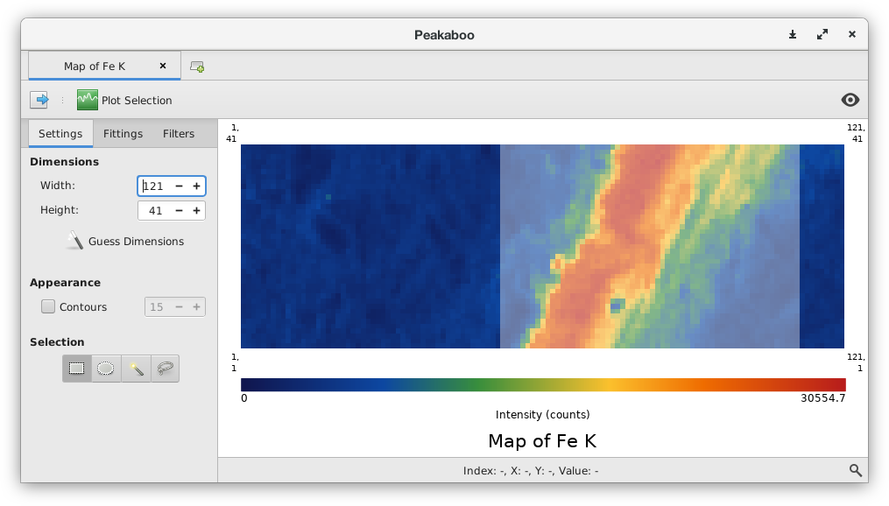
<p align="center">
Selecting a cropped subset of a data set
</p>

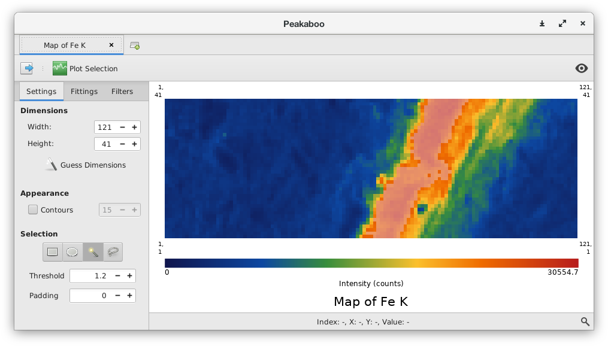
<p align="center">
Selecting a series of contiguous high-intensity points from the data set
</p>

The point-selection mode has two settings which will control how point
selections are made:

  - **Threshold** Threshold adjusts the sensitivity of the selection. For a threshold
    `t`, double-clicking a point with intensity `i` will select all
    contiguous points with an intensity between `i ÷ t` and
    `i × t`. For example, with a threshold setting of 2,
    double-clicking a point with a value 2 will select all touching
    points with a value between 50 and 200.

  - **Padding** Padding controls how many extra ‘rings’ of pixels get selected along
    with matching pixels. For example, when a point selection is made
    with a padding value of 1, all pixels which are adjacent to the
    selection area are added to the selection. For a larger padding
    value `p`, this process is repeated `p` times.

More complex selections can be made by holding the `Control` key while
clicking. For example, with point selection, `Control` + `Click` on a
previously unselected point will add to a previously selected set of
points, while a `Control` + `Click` within an existing selection will
subtract the new selection from the old. The same process works for the
other selection tools which use clicking and dragging instead of just
clicking. This feature combined with the point selection tool’s settings
can be used to create very specific selections, such as selecting a ring
around, but not including, an intense region.

## Plotting Subsections

Peakaboo also allows you to view spectra from selected regions within
your map. Using the same technique as described above to select a
subsection of your data, click ![plot] `Plot Region` to view the spectra
for the selected region. Another tab in the plotting window will open up
to display the spectra from the selected region or subset. The spectra
can then be processed with Peakaboo.

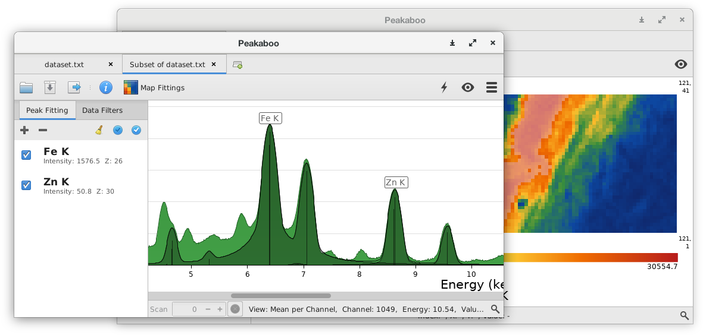
<p align="center">
Plotting window showing data for a subset of the original data set
</p>

# Plugins

Plugins are software components which are used by Peakaboo to extend
Peakaboo’s functionality. Plugins can add new filters or new file format
support to Peakaboo. There are [a number of plugins available along with
Peakaboo](https://github.com/nsherry4/PeakabooPlugins/releases/latest),
and anyone with some experience in Java programming can also make their
own.

You can manage Peakaboo’s plugins by selecting ![menu] `Menu` → `Plugins`.

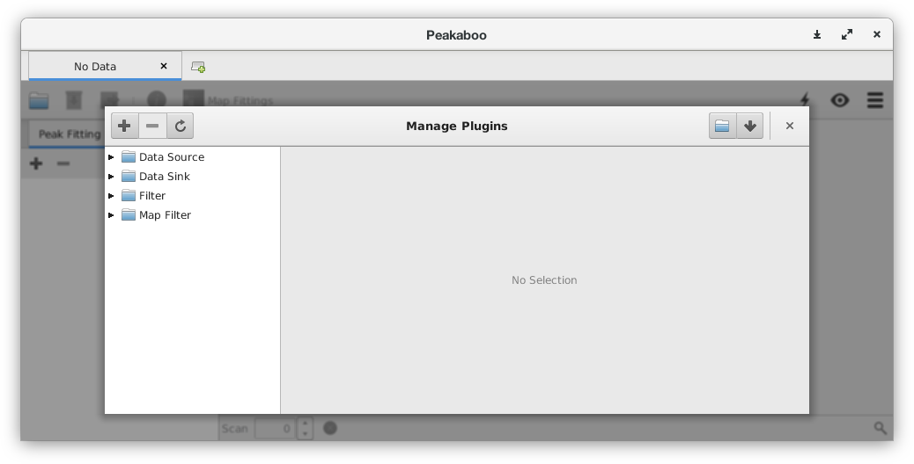
<p align="center">
Peakaboo’s plugin management screen
</p>

## Importing New Plugins

You can import new plugins to Peakaboo in three ways.

  - **Add Plugins Button** Clicking the ![add] `Add Plugins` button will open up a file
    browser so that you may select the plugin archive that you wish to
    import.

  - **Drag and Drop** If you drag and drop plugin archives onto the plugin management
    screen, Peakaboo will import them for you automatically.

  - **Manually** If you click the ![open-symbolic] `Open Plugins Folder` button, Peakaboo will
    open its plugins folder in a file browser. You can manage your
    plugins manually by adding or removing files. Be sure to update
    Peakaboo by clicking the ![refresh] `Reload Plugins` button after you’re
    done.

## Removing Existing Plugins

To remove a plugin, select it in the plugins list on the left side of
the plugin management screen, then click the ![remove] `Remove Plugins`
button. Be aware that if the plugin is contained in an archive along
with other plugins, those other plugins will be removed as well.

## Updating to Newer Versions

You can install updates to existing plugins the same way as you would
install a new plugin. If Peakaboo detects that the new plugin is an
upgrade, or that the filename matches an existing plugin archive, it
will prompt you to replace, rather than add, the plugin.

Sometimes having two version of a plugin may be unavoidable. When
Peakaboo detects two versions of a plugin, it will use the version which
has the higher version number.

# Extending Peakaboo

Peakaboo allows users who are familiar with the Java programming
language to extend its functionality by creating custom filters and
adding support for new file formats. Users who are interested in
developing extensions for Peakaboo will need to make sure they have the
Java Development Kit (JDK) installed on their computer (available from
[Java.com](http://java.com)). A dedicated code editor, such as Eclipse,
is also recommended.

Plugins in Peababoo are classes which implement a specific interface.
The interface in question depends on the kind of plugin being created.
These plugin classes should be bundled in `.jar` files and placed in the
correct plugin folder inside of the user’s application data directory.
For example, on Linux, this path is `~/.config/Peakaboo5/`. You can
access this folder by selecting ![menu] `Menu` → `Plugins` → ![open-symbolic] `Open Folder`.

In order to know which classes to load without scanning each class in
every jar file, a jar containing a plugin must include a manifest file,
located at `META-INF/services/` under the root of the jar file. The file
name must be the qualified name of the interface that this type of
plugin implements, and the contents of the file must be the qualified
names of each class to be loaded as a plugin, one per line.

The specific interfaces used for different types of plugins are:

  - **Data Source** `org.peakaboo.datasource.plugin.JavaDataSourcePlugin`

  - **Data Sink** `org.peakaboo.datasink.plugin.JavaDataSinkPlugin`

  - **Filter** `org.peakaboo.filter.plugin.JavaFilterPlugin`

Example plugins for both filters and data sources are [available
online](https://github.com/nsherry4/PeakabooPlugins/), along with a jar
file containing Peakaboo for building against.

## Filters

Custom filters must implement `JavaFilterPlugin`, and for
convenience may also extend the `AbstractSimpleFilter` or
`AbstractBackgroundFilter` classes, and should either not
define a constructor, or define a `public` no-argument constructor.

### Parameters

Filters define a series of `Parameter`s, each with an
associated data type. These parameters are displayed in the filter’s
settings panel, using the associated data types and class information to
determine what kind of widgets should be used. These parameters should
be created and initialized in the filter’s `initialize` method.

Once constructed, the parameter should be passed to the `addParameter`
method of the superclass. This method returns an integer value which you
can use to retrieve the parameter later using `getParameter(int index)`.
The alternative is to simply keep local references to all your `Parameter`s. 
Here is an example of the `initialize` method of the `Addition` filter:

```java
@Override
public void initialize()
{
  Parameter<Float> add = new Parameter<>(
    "Amount to Add", //Human-readable name
    new RealStyle(), //Style hint for UI generation
    1.0f,            //Starting value
    this::validate); //validation function
    
  addParameter(add);  
}
```

This creates a new `Parameter` called “Amount to Add” with
a Float data type, a default value of 1.0, and a validation function
defined elsewhere in the class body. It then adds it to this filter’s
set of parameters.

### Validation

Whenever the user makes changes to a filter’s parameter value in the
![settings] `Settings` dialog, the new parameter value is validated in a
call to the parameter’s validator method. In the example above, the
parameter’s validate method is in the filter itself, and could be used
by other parameters to validate combinations of values.

If the parameter values do not validate, then the values of the input
fields are reset to their old values.

### Processing Spectra

An active filter’s `filter(ReadOnlySpectrum data)` method is called
repeatedly. This method should return a modified `Spectrum` containing 
the results of filtering the input `ReadOnlySpectrum`.

The `Spectrum` and `ReadOnlySpectrum` classes have a `List`-like 
interface, but use a fixed-size `float` array to store the actual 
data for memory and performance reasons. If you prefer to work with 
the `float[]` data directly, the `backingArray` method provides
direct access to it.

## File Formats (Data Sources)

Adding support for new file formats in Peakaboo is accomplished by
creating a new Data Source. When creating a new data source, the 
`JavaDataSourcePlugin` interface must be implemented. The
implementation should either not define a constructor, or define a
`public` no-argument constructor. A Data Source has a number of methods
to retrieve other data structures, some of which are `Optional`.

### File Format

The `FileFormat` interface is how a Data Source describes
the type of files it reads and tests if it can read specific files. When
the user opens one or more files, Peakaboo must determine which Data
Source plugin(s) may be used, and it relies on the Data Source’s
FileFormat to inform it.

For convenience, the `SimpleFileFormat` class provides an
easy way to get started, with file-extension based testing and the
ability to specify single or multi-file support. Because many data
sources use very common file extentions (e.g. `.dat`) or container files
(e.g. `HDF`), developers should consider implementing proper testing
through an examination of a file’s contents.

### Reading the Data

Once your data source has been selected, the `void read( List< Path>
paths)` method will be called at most once. The paths given here will be
the same as the paths tested for compatibility through the supplied
`FileFormat`, so there is no need to recheck the files.

Because Peakaboo is an interactive desktop application, progress should
be reported to the user through the `Interaction` class.
The Data Source interface defines get/set methods for this object, and
this object will be set before the data is read. It contains several
methods which can be used to report progress or allow user control.

```java
boolean checkReadAborted()
void notifyScanCount(int scanCount)
void notifyScanRead(int number)
```

The `checkReadAborted` method checks to see if the user has decided to
abort the read operation. This method should be checked periodically,
and if it returns `true`, the read operation should be halted. The data
source instance will not be used after the user has requested the read
to be aborted, so there is no need to worry about any inconsistent state
caused by aborting the read. Any open files should still be closed.

The `notifyScanCount` method reports the number of scans in the data set
to the user interface. The `notifyScanRead` method reports that a
certain number of new scans have been read since it was last called.
These two methods used together allow Peakaboo to show the progress of
the read operation to the user. In some file formats, it is not feasible
to determine the number of scans in advance of reading them. In this
case, simply do not call either of these methods, and the interface will
show a “busy” indicator instead.

### Accessing the Data

Once the `read` method has been called, your data source will need to
provide access to the data. This is achieved through the `ScanData` 
interface. For convenience, the `SimpleScanData` class is provided. 
It is *highly* recommended that the `SimpleScanData` class be used 
in most cases, as it provides a number of performance and memory 
footprint optimizations. Other implementations of `ScanData` should 
study the `SimpleScanData` implementation for an idea of how to
achieve these for themselves.

### Providing Extended Information

Each data source reads from different kinds of files, which contain
different kinds of information about the scan. Further information can
be exposed through the `DataSize`, `PhysicalSize`, and `Metadata` 
interfaces, which are all access through the `DataSource` interface as
`Optional` values.

# Filter Descriptions

Because Peakaboo uses a plug-in system for fitlers, this cannot be an
exhaustive list, but it does cover all built-in filters.

## Background Filters

### Brukner

This filter removes background over several iterations by smoothing the
data and taking the minimum of the unsmoothed and smoothed data for each
channel on each pass.

### Linear Trim

This filter examines all pairs of points which are `n` channels apart
(ie `(1, 10), (2, 11), …` where `n = 10`). For each pair of points, any signal
which exceeds a straight line connecting the two points is truncated.

### Polynomial

This filter attempts to fit a series of parabolic (or higher order
single-term) curves under the data, with a curve centred at each
channel, and attempting to make each curve as tall as possible while
still staying completely under the spectrum. The union of these curves
is calculated and subtracted from the original data.

### Square Snip

This is a very fast background removal method based on the Peak
Stripping algorithm. It iteratively replaces signal with the average of
the points `(-window, +window)` channels apart if that average is less
than the existing signal. By taking a double square root of the signal
and then reversing it afterwards, the number if iterations required is
greatly reduced. Because noise-reduction filters are separate and
composable, this version of the algorithm does not do any smoothing
itself.

## Noise Filters

### Fourier Low-Pass

This filter transforms the spectral data with a Fourier Transformation
into a frequency domain. Data from a high frequency range (noise) is
filtered out, while lower frequencies (peaks, background) are passed
through.

### Weighted Averaging

This filter refines the values of each point in a scan by sampling it
and the `n` points to either side of it, and replacing it with an
exponentially weighted average of the sampled points.

### Savitsky-Golay

This filter attempts to remove noise by fitting a polynomial to each
point `P_i` and its surrounding points `P_(i-n) … P_(i+n)`, and
then taking the value of the polynomial at `P_i`. This filter is
generally fast, while minimizing peak distortion. A moving average may
be considered a special case of this filter with a polynomial of order
1.

### Spring Smoothing

This filter operates on the assumption that weak signal should be
smoothed more than strong signal. It treats each pair of adjacent points
as if they were connected by a spring. With each iteration, a tension
force draws neighbouring points closer together.

The `Force Multiplier` controls how strongly a pair of points are pulled
together, and the `Force Falloff Rate` controls how aggressively
stronger signal is anchored in place, unmoved by tension forces. This
prevents stronger intensity points such as peak shapes from being
distorted by the smoothing algorithm.

### Wavelet Low-Pass

This filter attempts to reduce high-frequency noise by performing a
Wavelet transformation on the spectrum. This breaks the data down into
sections each representing a different frequency range. The
high-frequency regions are then smoothed, and a reverse transform is
applied.

### Low Statistics

This filter smooths signal per-channel by shrinking a moving-average
window until either:

  - The signal in the window is less than Max Signal

  - Both of the following are true:
    
      - The signal in the window is less than `Threshold × sqrt(centerpoint)`
    
      - The slopes of the left vs. right windows is less than Max Slope

# Filtering Example

This example uses the Normalizer Filter.

When detector deadtime is very high, the detector cannot keep up with
the incoming x-rays. For example, low energy x-rays such as those coming
from `Ar` may not get counted and mapping the distribution of `Ar`
will reveal areas of next to no intensity.

The `Normalizer Filer` scales each spectrum so that the intensity at a
given channel is always the same. This filter can be used in this case
to correct the spectra. By normalizing against a channel from within the
`Ar` peak, we can mitigate the distortion caused by detector
saturation.

Go to the `Filters` tab and add the `Normalizer Filter` found under the
`Advanced` filter types. Click on the ![settings] `Settings` button to bring
up the settings window for the filter. Place the cursor on the `Ar`
peak in the spectrum and read the channel number and value (counts) from
the information found below the spectrum window, and enter them into the
appropriate settings fields. Make sure you are viewing the `Mean Average` 
spectrum to get the average value (counts) for the `Ar`.
Close the edit window.


<p align="center">
Uncorrected `Ar` with weak signal where `Ti` is strongest
</p>


<p align="center">
Uncorrected `Ti`
</p>


<p align="center">
Corrected `Ar`
</p>


<p align="center">
Corrected `Ti` with greater maximum intensity
</p>

## Mathematical Filters

### Add

This filter adds a constant value to all points on a spectrum.

### Subtract

This filter subtracts a constant value to all points on a spectrum.

### Multiply

This filter multiplies all points on a spectrum by a constant value.

### Derivative

This filter transforms the data such that each channel represents the
difference between itself and the channel before it.

### Integral

This filter transforms the data such that each channel represents the
sum of itself and all channels prior to it.

## Advanced Filters

### Normalizer

This scales each spectrum so that the intensity at a specified channel
is always the same across all spectra.

### Filter Partial Spectrum

This filter allows the application of another filter to a portion of a
spectrum.

# Citations

[^1]: M.O. Krause, C.W. Nestor, C.J. Sparks and E. Ricci, *X-Ray Fluorescence
Cross Sections for K and L X Rays of the elements*, Oak Ridge Report
ORNL-5399, 1978.


[open]: icons/document-open.png
[menu]: icons/menu-main.png
[save]: icons/document-save.png
[auto]: icons/auto.png
[map-size]: icons/map-size.png
[menu-energy]: icons/menu-energy.png
[menu-settings]: icons/menu-settings.png
[menu-view]: icons/menu-view.png
[export]: icons/document-export.png
[add]: icons/edit-add.png
[remove]: icons/edit-remove.png
[settings]: icons/menu-settings.png
[edit]: icons/edit-edit.png
[ok]: icons/ok.png
[cancel]: icons/cancel.png
[map]: icons/map.png
[help]: icons/app-help.png
[image-symbolic]: icons/mime-raster-symbolic.png
[plot]: icons/plot.png
[open-symbolic]: icons/document-open-symbolic.png
[refresh]: icons/action-refresh-symbolic.png
[find]: icons/find.png
[]: icons/.png
[]: icons/.png
